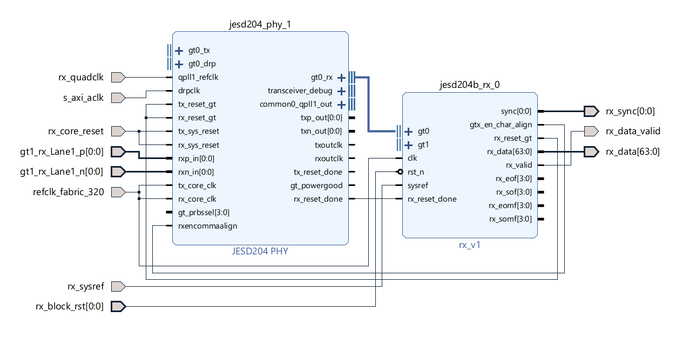

# ListenToJESD204B: A Lightweight Open-SourceJESD204B IP Core for FPGA-Based Ultrasound Acquisition systems

Welcome to **ListenToJESD204B**, an open-source, lightweight JESD204B receiver IP core developed for the **ListenToLight** open ultrasound platform. This core is designed to be easy to integrate, understand, and extend, while remaining compliant with the JESD204B standard.

This repository provides a fully-packaged Vivado IP, intended for use in custom FPGA designs that require high-speed serial data reception over the JESD204B interface.

---

## Packaging Structure

The Vivado-packaged IP is located in the [`jesd204b_rx_ip`](./jesd204b_rx_ip) directory, and follows the standard Vivado IP packaging structure. 

<pre> jesd204b_rx_ip/ 
├── src/ # RTL source files 
├── xgui/ # Custom GUI definition for IP customization 
├── component.xml # Metadata and interface definition for Vivado </pre>


All RTL source files used to build the IP are located in the `src/` directory. The IP includes modules for Code Group Sync, ILAS monitoring, Descrambling, LMFC Generation, and Elastic Buffering.

---

## Vivado Integration

To use this IP in your own Vivado project, follow these steps:

1. **Clone this repository:**

   ```bash
   git clone https://github.com/pulp-bio/ListenToJESD.git
    ```


2. **Instructions for Vivado**:

- Open your project.
- Go to **Tools > Settings > IP > Repository**.
- Click **Add Repository** and select the path to the cloned `jesd204b_rx_ip/` folder.
- Click **OK**.

Vivado should now detect the IP and list it as available in the IP catalog.

3. **Instantiate the IP in your block design**

- In the **IP Catalog**, search for `rx_v1`.
- Drag and drop it into your block design.
- Customize parameters as needed via the IP customization GUI.
- Connect interfaces according to your system's requirements.

<p align="center">
  
</p>
<p align="center"><em>Figure 1: Connection Reference with Xilinx JESD204B PHY Block</em></p>

4. **Build the design**
- Synthesize, implement, and generate your bitstream.

*Note : This IP requires the same clock as the one supplied to the PHY block*

---
## Documentation

For a detailed explanation of the IP's internal architecture and design decisions, see the accompanying technical report found in the `docs/` folder or browse the comments in the RTL source files. For a concise overview, refer to the paper ListenToJESD204B: A Lightweight Open-Source JESD204B IP Core for FPGA-Based Ultrasound Acquisition systems
accepted to 10th IEEE International Workshop on Advances in Sensors and Interfaces (IWASI 2025).

---

## Tested Platforms

- **Vivado Version:** 2023.2  
- **Test Environment:** Zynq Ultrascale+ MPSoC XZCU19eg
- **Compliance:** JESD204B Subclass-1

---

## Example Implementation

[`implementation_example/`](./implementation_example/) folder is organized to support a fully automated Vivado block design flow. All relevant components—including the JESD204B RX IP, supporting RTL, constraints, and scripts—are structured for portability and reproducibility.

<pre>project_root/
├── bd/
│ └── block_design.tcl # TCL script to recreate the Vivado block design
├── ip_repo/
│ └── jesd204b_rx_ip/ # Vivado packaged IP core 
├── source/ # RTL source files
│ ├── top.v 
│ ├── JESD_control_sm.sv
│ └── jesd_stream_flattener*.v
├── constraints/
│ └── constraints_main.xdc # Design constraints
├── top.tcl # Master build script to set up the build </pre>

To build the complete block design and recreate the project, follow these steps:

### 1. Launch Vivado
Launch Vivado on your system and proceed to the next step.

### 2. Run the Setup Script

In the Vivado Tcl console, source the top-level build script:

```tcl
source top.tcl
```
This script performs the following actions:
- Creates a new Vivado project
- Adds RTL source files from source/
- Adds constraints from constraints/
- Adds the JESD204B IP repository from ip_repo/
- Rebuilds the IP catalog and block design
- Optionally launches synthesis and implementation

*Note: Ensure the IP repository path inside top.tcl matches the actual locations while building the project*

---
## Testbench Support

The following enhancement is planned to be added soon:

-  **Example Testbench** : A TCL script based flow to recreate and build the modified Xilinx JESD204C example testbench will be provided. To run this test bench atleast an evaluation license for the JESD204C IP is required.

---

## License

This repository is available under the Solderpad Hardware License Version 0.51.
The images are licensed under a Creative Commons Attribution 4.0 International License (CC BY 4.0).

For further information have a look at the license files.

---


