# JESD204B RX Lite IP Core

An open-source JESD204B Receiver IP core implementation in SystemVerilog for Xilinx UltraScale+ devices.

## Overview

This project provides a modular, configurable JESD204B Receiver (RX) IP core that complies with Subclass 1 of the JESD204B standard. The design supports multi-lane configurations with line rates up to 12.8 Gb/s and focuses on deterministic latency while maintaining a minimal resource footprint.

## Key Features

- Open-source implementation in SystemVerilog
- Support for JESD204B Subclass 1 operation
- Multi-lane support with deterministic latency
- Vivado IP packaging for easy integration
- Significant resource savings compared to commercial solutions
- Fully verified through simulation and hardware testing

## Table of Contents

- [Theory and Related Work](#theory-and-related-work)
  - [Zynq Ultrascale + MPSoC XCZU19EG Overview](#zynq-ultrascale--mpsoc-xczu19eg-overview)
  - [Deterministic Latency](#deterministic-latency)
  - [JESD204B Protocol](#jesd204b-protocol)
    - [JESD204B Physical Layer](#jesd204b-physical-layer)
    - [JESD204B Link Layer](#jesd204b-link-layer)
    - [Deterministic Latency and SYSREF](#deterministic-latency-and-sysref)
    - [Related Works](#related-works)
- [JESD204B Rx Implementation](#jesd204b-rx-implementation)
  - [Top Level Architecture](#top-level-architecture)
    - [Design Considerations](#design-considerations)
  - [Interfacing with the JESD204B Physical Block](#interfacing-with-the-jesd204b-physical-block)
  - [RX Top Module](#rx-top-module)
    - [RX Control FSM](#rx-control-fsm)
    - [RX Data Path](#rx-data-path)
  - [LMFC Generation](#lmfc-generation)
    - [Verification Methodology](#verification-methodology)
- [Results](#results)
  - [Simulation Setup & Results](#simulation-setup--results)
  - [Hardware Integration & Testing](#hardware-integration--testing)
  - [Performance and Resource Utilization](#performance-and-resource-utilization)
  - [Summary](#summary)
- [Conclusion and Future Work](#conclusion-and-future-work)
  - [Conclusion](#conclusion)
  - [Future Work](#future-work)

-----------------------------------------------------------------------
# Theory and Related Work

This section presents the essential theoretical concepts required to understand the work undertaken in this semester thesis. It outlines the foundational principles of the JESD204B protocol, with a particular focus on the receiver (Rx) architecture, and highlights the key mechanisms enabling high-speed, deterministic data transmission. Where appropriate, references to existing literature and standards are provided to guide readers seeking a more in-depth understanding of the protocol and its implementation nuances.

## Zynq Ultrascale + MPSoC XCZU19EG Overview

The AMD Zynq™ UltraScale+™ MPSoC XCZU19EG is a high-performance, heterogeneous computing platform that integrates:

- Quad-core ARM® Cortex®-A53 application processors (up to 1.5 GHz)
- Dual-core ARM Cortex-R5F real-time processors (up to 600 MHz)
- Mali-400 MP2 GPU for graphics processing
- Programmable Logic (PL) with over 1.1 million logic cells
- High-speed transceivers: 32 GTH transceivers supporting up to 12.5 Gbps and 16 GTY transceivers supporting up to 28.21 Gbps

This integration enables the XCZU19EG to handle complex processing tasks, making it suitable for applications requiring high-throughput and low-latency data processing. It is well-equipped to implement the JESD204B interface primarily due to:

- Transceiver Support: The device's GTH and GTY transceivers support line rates up to 12.5 Gbps and 28.21 Gbps respectively.
- AMD provides LogiCORE™ IP cores for JESD204B, including the JESD204 PHY and JESD204 core, which handle the physical and data link layers of the protocol.
- The MPSoC design ensures there is a High PL Density, Integrated Processing System as well as enough Memory Resources (DDR4 support) for an end to end pipeline design

## Deterministic Latency

Deterministic latency refers to the ability of a system to guarantee a fixed and repeatable delay between the transmission and reception of data. In high-speed digital signal processing (DSP) systems, particularly those involving multichannel data acquisition, real-time feedback, or tightly synchronized sensor arrays, deterministic latency ensures that signal timing remains predictable across all processing elements. This is critical for applications such as phased-array systems, software-defined radios, and medical imaging, where timing mismatches can lead to data corruption, beamforming errors, or image artifacts. The concept became particularly important as serial data interfaces like JESD204B replaced parallel buses, which inherently provided tighter timing guarantees. JESD204B introduced Subclass 1 to address this issue by aligning the internal frame clocks of all devices using a shared *SYSREF* signal and *lmfc*, allowing deterministic timing across multiple links and devices. This mechanism allows systems to meet real-time processing constraints with confidence in timing reproducibility across power cycles or resets.

## JESD204B Protocol

The JESD204B standard defines a high-speed serial interface for connecting one or multiple data converters (adc or dac) to a digital processing device. Unlike legacy parallel interfaces that require a separate set of data lines for each bit, JESD204B uses framed serial links with embedded clocks and alignment characters, enabling significantly higher data throughput while simplifying board design. Supporting line rates of up to 12.5 Gbps per lane, JESD204B minimizes the number of interconnects, reduces PCB routing complexity, and eliminates stringent setup and hold timing constraints traditionally associated with wide parallel buses.

However, the shift to serial communication introduces new challenges, particularly in ensuring that all lanes remain synchronized and that the receiver interprets data boundaries consistently. To address this, the JESD204B standard specifies a structured three-phase process to establish a reliable link between the transmitter and receiver:

- Code Group Synchronization (CGS): Each receiver lane identifies comma characters (typically /K28.5/) to align the 8B/10B decoder and establish symbol boundaries.
- Initial Lane Alignment Sequence (ILAS): The transmitter sends configuration data in predefined multiframes containing control characters like /R/ and /A/, which the receiver uses to validate link parameters and deskew lanes.
- Data Phase: Regular data transmission begins with optional scrambling and strict frame and multiframe boundary alignment based on clock domains.

To function correctly, a JESD204B link requires a shared device clock, and synchronization signals including SYNC$`\sim`$ and, for Subclass 1, SYSREF. These signals enable deterministic alignment across multiple devices.

JESD204B supports flexible configuration through several key parameters that determine link behavior and how data is mapped across lanes:

| **Parameter** | **Description** |
|:--:|:---|
| **M** | Number of data converters. |
| **L** | Number of physical lanes used for data transmission. |
| **F** | Number of octets per frame. |
| **S** | Number of samples per frame. |
| **K** | Number of frames per multiframe. |
| **N** | Resolution of each converter in bits. |
| **N$`'`$** | Total number of bits per sample, including control and padding bits (must be a multiple of 4). |

Configurable parameters in the JESD204B standard

For the purposes of this work, only the *Physical and Link layers* of the JESD204B protocol are utilized and described in this documentation.

### JESD204B Physical Layer

The Physical Layer (PHY) in the JESD204B protocol is responsible for the electrical and logical transmission of serialized data between data converters and digital processing devices such as fpgas. It ensures high-speed, reliable communication over serial links, handling tasks such as serialization/deserialization, clock recovery, and data alignment.

The Physical layer encompasses several critical components:

- serdes: Converts parallel data into serial form for transmission and vice versa for reception.
- cdr: Extracts timing information from the incoming data stream to maintain synchronization.
- 8B/10B Encoding/Decoding: Ensures DC balance and provides sufficient transitions for reliable clock recovery.

These components collectively ensure that high-speed serial data is transmitted and received accurately, maintaining data integrity across the link. The JESD204B specification supports three possible speed grades. Speed Grade 1 supports up to 3.125 Gbps and is based on the OIF-SxI5-0.10 specification. Speed Grade 2 supports up to 6.375 Gbps and is based on the CEI-6G-SR specification. The third speed grade supports up to 12.5 Gbps and is based on the CEI-11G-SR specification.

#### Implementation Using Xilinx GTH Transceivers

In Xilinx FPGAs, such as the Zynq UltraScale+ series, the physical layer of the JESD204B protocol is implemented using integrated high-speed transceivers, specifically the GTH transceivers. These transceivers handle the analog aspects of signal transmission, while the PHY IP core manages the digital protocol requirements.

The AMD LogiCORE™ JESD204 PHY IP core facilitates this integration by providing a configurable interface that connects the JESD204 logic to the GTH transceivers.

Key features of this IP core include:

- Support for JESD204B and JESD204C standards: Ensures compatibility with a wide range of devices and systems.
- Configurable number of lanes: Allows scalability based on system requirements.
- Support for Subclasses 0, 1, and 2: Facilitates deterministic latency and synchronization as needed.

Using GTH transceivers and the JESD204 PHY IP core, designers can implement robust, high-speed serial interface designs.

### JESD204B Link Layer

The *Link Layer* in the JESD204B protocol plays a critical role in establishing, maintaining, and synchronizing the serial communication link between data converters and digital receivers. It builds upon the Physical Layer and provides mechanisms for symbol alignment, code group synchronization, lane alignment, and error handling, ensuring that high-speed serial data is delivered reliably and with deterministic latency.

The following subsections outline the main functional blocks of the JESD204B Link Layer:

#### Code Group Synchronization

cgs is the first phase of link establishment. During cgs, the transmitter sends a continuous stream of /K28.5/ control characters. The receiver uses this pattern to align symbols to 8-bit boundaries and confirms link connectivity. Successful detection of the expected comma symbols allows the receiver to exit CGS and proceed to the next phase.

#### Initial Lane Alignment Sequence

Once cgs is complete, the link enters the ilas. During this phase, the transmitter sends predefined multiframes that contain synchronization characters (e.g., /R/, /A/) and configuration parameters (L, M, F, K, etc.). The receiver uses this information to align all active lanes, de-skew data streams, and verify that configuration expectations match.

#### Lane Alignment and Skew Management

Due to physical routing differences or unequal delays in signal paths, data across multiple lanes may arrive at the receiver at slightly different times. Lane alignment logic ensures that data from all lanes is re-aligned at multi-frame boundaries using elastic buffers or FIFOs, so that sample order is preserved. This process is essential for accurate frame reconstruction, especially in systems with interleaved or multi-channel data.

### Deterministic Latency and SYSREF

In Subclass 1, the receiver uses a periodic or pulsed SYSREF signal to align its lmfc with that of the transmitter. This enables deterministic latency.

Below is a table listing the most common special characters used in the JESD204B link layer.

| **Symbol** | **Notation** | **Purpose** |
|:--:|:--:|:---|
| Comma | K28.5 | Used during cgs for symbol alignment and 8B/10B decoder synchronization. |
| Start of Multiframe | /R/ (K28.0) | Marks the start of a multiframe during ilas. |
| End of Multiframe | /A/ (K28.3) | Marks the end of a multiframe during ilas. |
| Start of Frame | /F/ (K28.7) | Indicates the start of a frame boundary. Used in some applications for monitoring or debugging. |
| Idle | /I/ (K28.6) | Sent when no data is transmitted; keeps the link alive. |
| Control Symbol | /Q/ (K28.4) | Optional: Can be used for alignment or system-specific signaling. |

Special Control Characters used in JESD204B

This link layer handles most of the complexity in establishing and stabilizing JESD204B links. The specific hardware implementation of these modules is described in <a href="#chap:implementation" data-reference-type="ref" data-reference="chap:implementation">3</a>, where overall structure, design and interface decisions are discussed in more detail.

# JESD204B Rx Implementation

This section provides an architectural overview of the primary modules of the JESD204B RX IP core. Each section outlines the functions and integration of the respective components within the overall design. For detailed implementation and source-level documentation, it is recommended to consult the annotated source code.

## Top Level Architecture4

The JESD204B RX IP core is designed as a modular SystemVerilog implementation that adheres to the JESD204B Subclass 1 specification. The architecture separates control logic, data path processing, and synchronization functionality to improve clarity, configurability, and testability. The top-level module integrates these functional blocks and provides a clean interface to both the JESD204B physical layer and downstream application logic as a possible AXI Stream.

<figure id="fig:rx_ip">
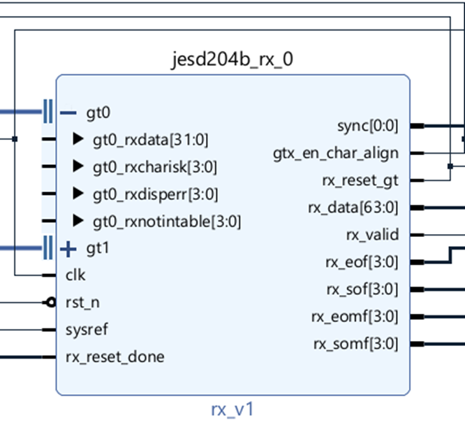
<figcaption>JESD204 RX Lite IP</figcaption>
</figure>

To facilitate ease of integration into larger FPGA designs, the JESD204B RX core has been packaged as a reusable IP block within Vivado using the IP Packager tool. This enables seamless insertion into block design flows, where the IP can be instantiated and connected graphically. The IP core exposes a clean parameter interface, allowing configuration of key protocol parameters such as the number of lanes, octets per frame, multiframe structure, and descrambling support directly through the Vivado GUI. Moreover, its modular structure supports flexible adaptation to different numbers of GTX interfaces, making it suitable for both single-lane and multi-lane JESD204B applications.

### Design Considerations

The implementation prioritizes a minimal yet functionally robust architecture that is straightforward to integrate and extend. Key design decisions were made with the goals of clarity, configurability, and ease of deployment in mind. The following considerations shaped the structure of the JESD204B RX IP core and may serve as useful reference points for future enhancements:

- **Unified Clocking Architecture:** A single clock derived from the JESD204B line rate is used to drive all internal logic. Unlike the Xilinx IP, which employs separate clocks for the transport and link layers, this approach eliminates clock domain crossings and simplifies timing closure.

- **Fixed Octet Parallelism:** The design processes four octets per clock cycle, as this is a commonly adopted frame width in JESD204B systems. This choice ensures a balance between throughput and simplicity. While the current implementation is fixed to 4 octets per frame or its multiples, support for other widths can be introduced in future versions with parameterization.

- **Simplified Buffer Configuration:** Although the elastic buffer size is configurable at the RTL level, it is not exposed as a top-level parameter. This decision was made to avoid overwhelming users with low-level configuration choices, thereby reducing integration complexity.

- **Standardized Data Width:** The internal data width is fixed at 32 bits, matching the transport layer output width of the JESD204B physical interface. This ensures compatibility with typical GTH transceiver configurations on UltraScale+ devices and aligns with standard IP interface widths.

- **Resource Efficiency:** The design avoids unnecessary pipelining and keeps finite state machines compact, ensuring a small logic footprint. Since the design was able to meet timing closure for the highest clock frequency it needs to operate in, this choice was made. Also a tradeoff was made to not add register re-configurability in the favor of a much lower design footprint.

- **Modular Architecture:** The receiver is structured as a collection of well-defined modules, each responsible for a specific functional domain—such as control flow, data path processing, alignment, and synchronization. This separation improves readability, testability, and maintainability, and facilitates future extensions or verification efforts.

- **Vivado IP Packaging:** To simplify deployment, the design is packaged as a reusable IP block within the Vivado ecosystem. This allows users to configure key parameters via the graphical interface and instantiate the IP in block designs without dealing directly with RTL-level details. It also enables better portability and integration across different projects and platforms. Currently the IP supports upto 4 different lanes but this can be increased very easily by modifying the top level wrapper.

## Interfacing with the JESD204B Physical Block

The RX IP core interfaces with the AMD LogiCORE JESD204 PHY IP (Xilinx GTH transceivers). The important interface signals used in the Receiver IP design are described here :

<figure id="fig:phy_intf">
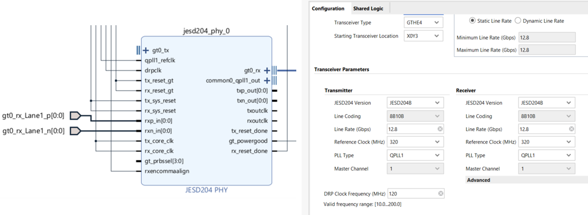
<figcaption>JESD204 PHY Block with reference configuration</figcaption>
</figure>

- **rxp_in**: Differential positive input pin for the serial data stream received from the JESD204B transmitter.

- **rx_sys_reset**: Asynchronous system-level reset signal for the receiver. When asserted, it resets the receiver logic to a known state.

- **rx_core_reset**: Synchronous reset signal for the JESD204B receiver core. Used to reset the core logic without affecting the transceiver.

- **rx_reset_gt**: Reset signal for the Gigabit Transceiver (GT) receiver. When asserted, it resets the GT receiver circuitry.

- **rxencommaalign**: Control signal that enables comma alignment in the receiver. When asserted, the receiver searches for comma characters to align the data stream correctly.

- **rx_reset_done**: Status signal indicating the completion of the receiver reset sequence. When asserted, it signifies that the receiver has successfully completed its reset process.

- **gt_power_good**: Status signal indicating that the GT transceiver power supplies are within the specified operating range.

- **gt_rx interface**: Refers to the set of signals associated with the GT receiver interface. The individual interface components are described in section <a href="#sec:topmodule" data-reference-type="ref" data-reference="sec:topmodule">3.3</a>.

The configuration used for this project is shown in <a href="#fig:phy_intf" data-reference-type="ref" data-reference="fig:phy_intf">3.2</a>. This IP needs to be reconfigured depending on the use case. More details are present in section <a href="#sec:design" data-reference-type="ref" data-reference="sec:design">3.1.1</a>.

## RX Top Module

The top-level module of the RX IP core is a wrapper which handles interface management for smooth block design flow. The RX module, as shown below, instantiated in the wrapper serves as the integration point for the control FSM, data path logic, and alignment infrastructure.

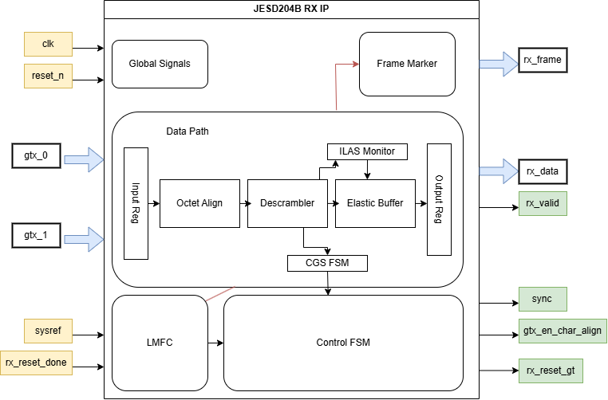

This module is responsible for orchestrating all essential JESD204B receiver functionality, including frame alignment, synchronization, and deterministic latency management. It instantiates and connects all subordinate modules in a clean, modular structure, allowing for high configurability across different configurations. The core responsibilities of the RX module include interfacing with the deserialized GTX data stream, managing the cgs and ilas sequences, aligning data using the SYSREF-based lmfc, and forwarding correctly framed and synchronized data to the system. All JESD204B framing parameters, such as the number of octets per frame (F) and frames per multiframe (K), are configurable via module parameters, allowing the design to scale.

Internally, the RX module integrates multiple sub-blocks, including the Control FSM, LMFC generator, Frame Marker, and multiple instantiations of the Data Path module — one per lane for parallel processing. Pipelined buffering is used at both the input and output to ensure stable timing closure and minimize combinatorial depth between transceiver data input and application-facing data output. It also contains the buffer release logic, which controls when the elastic buffers across all lanes begin forwarding valid data to the downstream modules. This mechanism is tightly coupled to the lmfc alignment and ensures that all lanes are ready and properly deskewed before data is released. The release is gated by a programmable delay and a readiness check across all buffers, enabling deterministic startup behavior aligned to multiframe boundaries. Critical coordination across lanes is achieved through elastic buffers and lane alignment logic, while the lane latency monitor tracks per-lane delays.

### RX Control FSM

The control finite state machine orchestrates the sequential progression of the link through various initialization and synchronization phases. It ensures that the physical and link layer components transition safely from reset through synchronization, enabling data reception in a deterministic manner. The FSM operates in four well-defined states: `ST_RESET`, `ST_WAIT_FOR_PHY`, `ST_CGS`, and `ST_SYNCED`.

The `ST_RESET` state is the initial condition, where the FSM asserts reset signals to the transceiver and the internal pipeline. This ensures that all receiver logic is initialized to a known state. A short counter ensures that the reset is held for a minimum duration. Once the GT receiver reset is complete, the FSM transitions to `ST_WAIT_FOR_PHY`.

In the `ST_WAIT_FOR_PHY` state, the FSM waits for the physical layer to report readiness via the `gtx_ready_i` signal. Once `gtx_ready_i` is asserted, the FSM transitions to the `ST_CGS` state, where cgs is established.

During `ST_CGS`, the FSM monitors each lane’s `cgs_detected_i` signal. This state ensures that all active lanes have successfully detected /K28.5/ comma characters. Comma detection is a prerequisite for byte alignment and proper lane framing. In this state, the FSM also enables the character alignment logic in the transceiver via `gtx_en_char_align_o` and asserts `cgs_rst_o` to maintain control over the cgs phase. Once all lanes have reported successful cgs and the condition remains stable for a programmablenumber of clock cycles, the FSM transitions to `ST_SYNCED`.

The `ST_SYNCED` state indicates that the link is fully synchronized and ready for data reception. During this phase, frame alignment is finalized, the latency monitor is released (`latency_monitor_rst_n_o`), and Initial Frame Synchronization resets are controlled via `ifs_rst_o`. If frame alignment error detection is enabled, the FSM continues to monitor error flags such as `gtx_notintable_i` and `gtx_disperr_i`. A built-in tolerance counter is used to filter out transient errors. If sustained errors are detected, the FSM treats this as a loss of synchronization and transitions back to `ST_RESET` to reinitialize the link.

To ensure robustness, the FSM incorporates a `goto_next_state` mechanism. This flag is asserted only when the current state’s conditions are considered stable for a minimum number of clock cycles. The stability counter is reset if the required condition is not met and ensuring that transient glitches or race conditions do not cause false state transitions.

<figure id="fig:ctrl_fsm_vertical">

<figcaption>RX control FSM</figcaption>
</figure>

### RX Data Path

The JESD204B RX data path module implements the core protocol processing required to decode, align, and forward valid data from the physical layer to the application interface. Each data path instance operates on one physical lane and handles character validation, comma detection, octet alignment, and descrambling as per the JESD204B standard. The module supports a configurable number of parallel octets per clock cycle and a parameterizable data width.

Incoming data and control characters from the GTX receiver are first classified to identify valid 8B/10B symbols and detect special control characters like K28.5. This enables the detection of CGS sequences and helps align the received serial stream to known byte boundaries. Once synchronization is achieved, an octet alignment unit reorders the byte lanes to ensure consistent framing. The design includes an optional descrambler stage, which is conditionally activated based on a configuration parameter, and uses a polynomial-based LFSR to reverse the scrambling applied by the transmitter. The scrambling follows the standard polynomial: $`P(x) = x^{14} + x^{13} + 1`$

To ensure correct data framing and timing, the data path includes an elastic buffer that compensates for latency variations and provides controlled data release. A dedicated Initial Lane Alignment Sequence monitor validates protocol-specific configuration data embedded in the received stream, and the module only begins passing valid data forward after successful ILAS completion. The pipeline is carefully staged to ensure low latency and clean separation between protocol phases.

## LMFC Generation

The Local Multiframe Clock (LMFC) generator plays a crucial role in ensuring deterministic latency in JESD204B Subclass 1 systems by aligning internal frame timing with a global reference provided through the SYSREF signal. The LMFC module monitors this periodic SYSREF pulse and, upon its detection, resets an internal 8-bit counter that tracks the number of parallel transfer beats per multiframe. This reset ensures that all participating lanes and devices begin counting multiframe boundaries from a common point in time. The counter increments synchronously with the data clock and rolls over after a full multiframe period, as defined by the parameter `BEATS_PER_MULTIFRAME`. A one-cycle pulse is generated at each counter reset, serving as the LMFC clock , which is distributed to other modules to mark the start of each new multiframe. The design includes edge detection and synchronization logic to safely capture asynchronous SYSREF pulses within the system clock domain, ensuring stable and glitch-free operation.

### Verification Methodology

The JESD204B RX IP core was verified through a combination of simulation and hardware validation. Functional simulation was conducted using a testbench derived from the example design provided with the Xilinx JESD204C IP core. This testbench was adapted to match the configuration parameters of the developed IP. The simulation methodology, illustrated in <a href="#fig:verf" data-reference-type="ref" data-reference="fig:verf">3.5</a>, relies on a differential comparison approach: identical input stimuli were applied to both the custom IP and the proprietary Xilinx IP, and the resulting outputs were compared cycle-by-cycle to ensure functional equivalence.

<figure id="fig:verf">
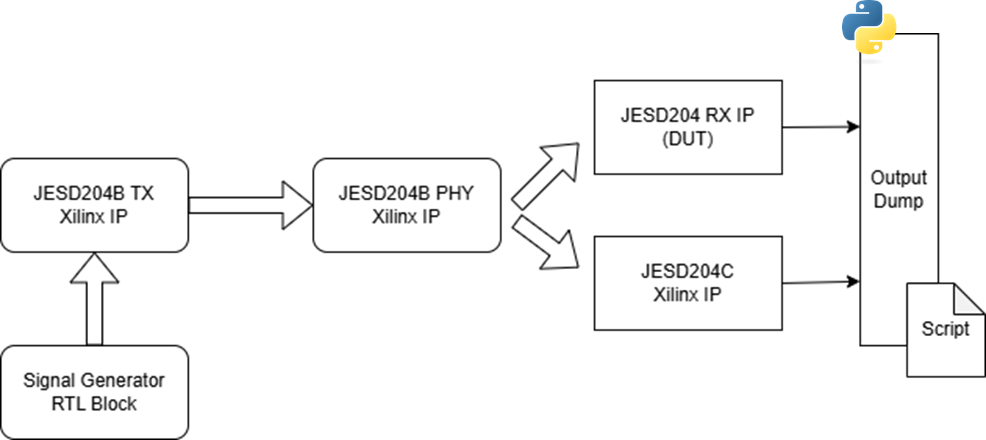
<figcaption>Functional Verification of RX IP</figcaption>
</figure>

For hardware verification, the RX IP was integrated into the ListenToLight platform, which features a Xilinx Zynq UltraScale+ SoC. The receiver was connected to a JESD204B-compliant ADC via high-speed serial lanes, replicating a realistic data acquisition pipeline. Internal signals were monitored in real time using the Integrated Logic Analyzer (ILA) core in Vivado. The successful capture of valid, multichannel ADC data across multiple acquisitions confirmed correct operation of the receiver logic in a live hardware environment.

# Results

This chapter presents the methodology and outcomes of both simulation-based and hardware-level testing of the JESD204B RX IP core. The results validate the correct operation of the receiver logic across the complete protocol chain—including link bring-up, synchronization, and data transmission while highlighting its compatibility with high-speed ADC data sources and its functional equivalence to the baseline - proprietary IP.

## Simulation Setup & Results

To verify the correctness of the design at the behavioral level, a testbench was adapted from the example design of the Xilinx JESD204C IP core. The testbench was modified to reflect the JESD204B Subclass 1 behavior and to align with the interface conventions of the open-source receiver. This testbench is also provided as part of the repository of the IP. The simulation setup applies a stimulus to both the custom and Xilinx IP cores and performs cycle-by-cycle comparisons of their output under controlled conditions. **To run this testbench, the user requires a license of the JESD204C IP**.

<figure id="fig:tb_01">
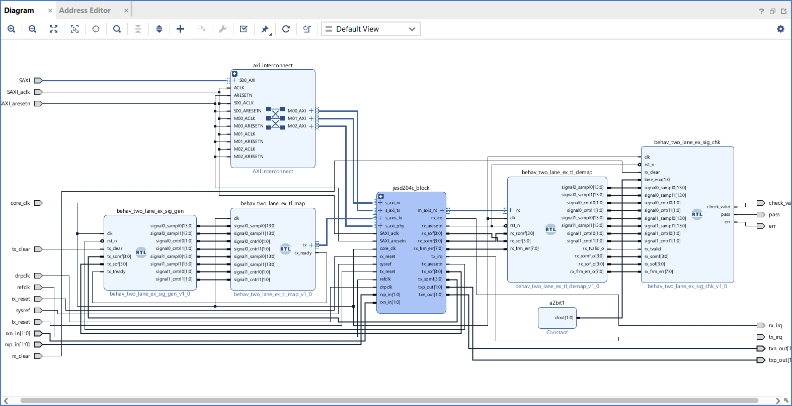
<figcaption>Testbench Setup for Behavioral Simulation</figcaption>
</figure>

<figure id="fig:tb_02">
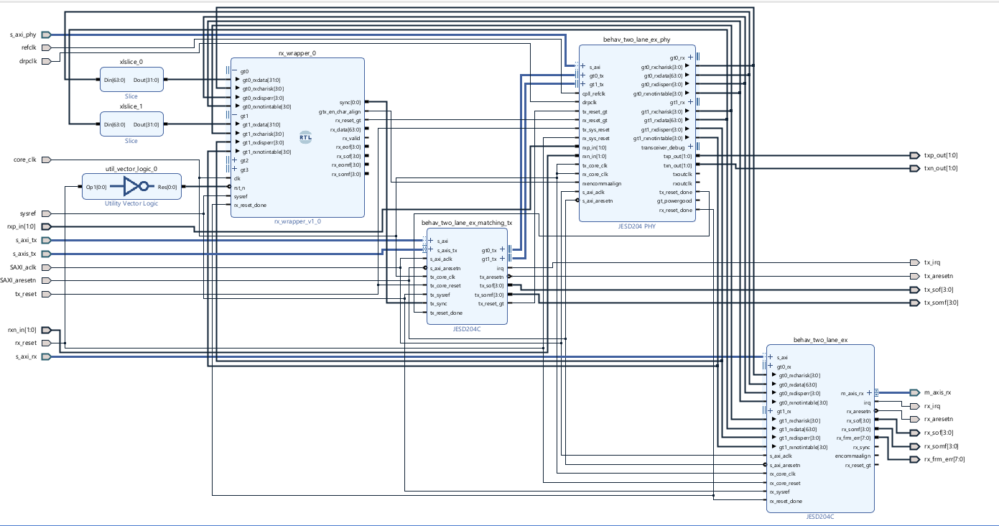
<figcaption>Testbench Setup : A look inside the JESD subsystem</figcaption>
</figure>

All major phases of the protocol were exercised during simulation: cgs, ilas, and data transmission. SYSREF signals were injected to validate LMFC alignment, and lane skew was artificially introduced to test the robustness of the elastic buffer and alignment logic. The receiver successfully detected the CGS phase, parsed the ILAS sequence, and transitioned to data mode while producing outputs equivalent to the reference Xilinx IP. A sample of the output generated during simulation is shown in figures <a href="#fig:res_01" data-reference-type="ref" data-reference="fig:res_01">4.3</a> and <a href="#fig:res_02" data-reference-type="ref" data-reference="fig:res_02">4.4</a>.

<figure id="fig:res_01">
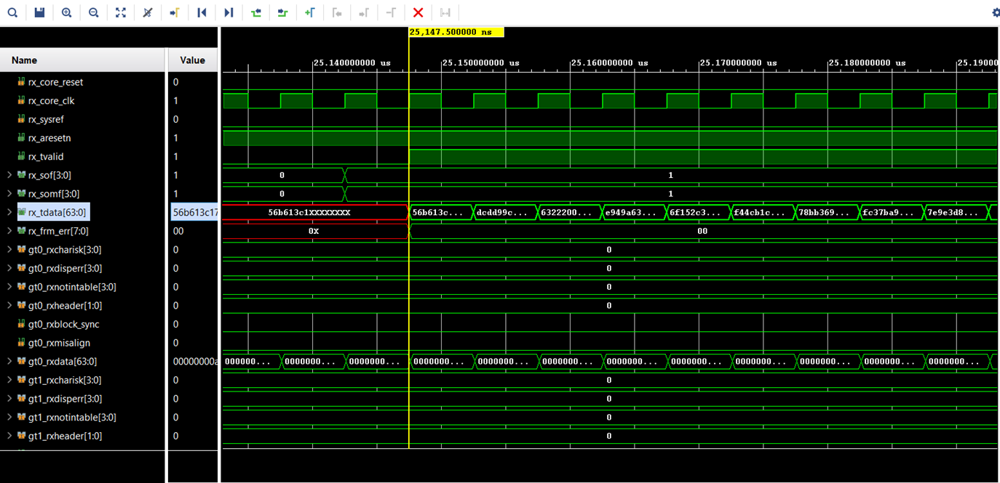
<figcaption>Simulation Output for Xilinx JESD204C IP configured to run JESD204B</figcaption>
</figure>

<figure id="fig:res_02">
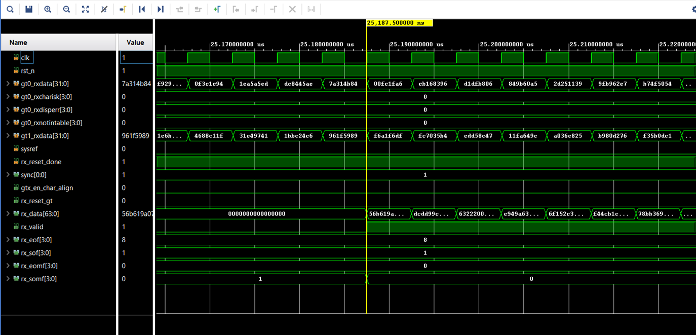
<figcaption>Simulation Output for JESD204B Lite RX IP</figcaption>
</figure>

These simulation results confirm that the developed IP core adheres to the JESD204B protocol, supports deterministic multiframe alignment, and correctly reconstructs framed and descrambled data. They also establish a confidence baseline before hardware deployment.

## Hardware Integration & Testing

Following simulation validation, the IP core was integrated into the ListenToLight platform built around a Xilinx Zynq UltraScale+ MPSoC. The design was instantiated as a Vivado-packaged IP block and connected via a JESD204B PHY interface to a multi-channel ADC supporting line rates of up to 12.8 Gb/s. Clocking and SYSREF generation were handled using the on-board clock distribution network. The integration into the existing platform required some additional RTL blocks, which are not described in the report but available in the repository and can be modified to suit the needs of the end user. The block diagram of the design is shown in figure <a href="#fig:hardware_design" data-reference-type="ref" data-reference="fig:hardware_design">4.5</a>

<figure id="fig:hardware_design">
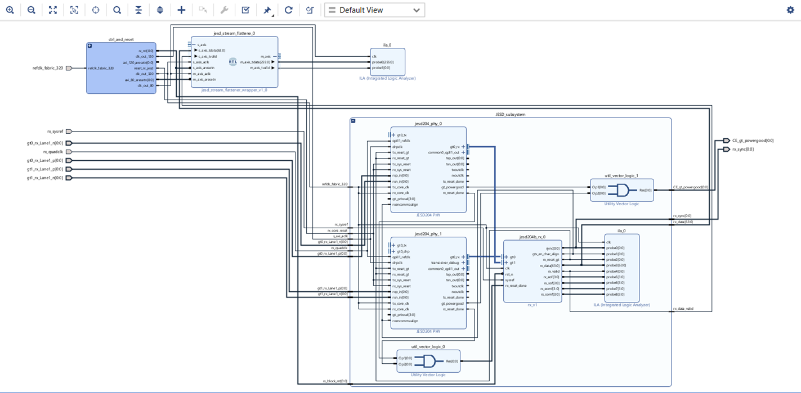
<figcaption>Block Design of JESD204B RX IP integrated into ListenToLight Project</figcaption>
</figure>

The bitstream was generated, and the FPGA was programmed to test the effectiveness with samples captured using an ADC capable of sampling at 80 Msps. A signal generator was used to capture a 1 MHz sinusoidal signal by the ADC and transmitted to the board. The setup is shown below:

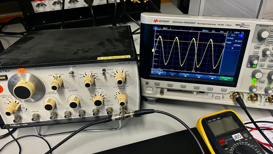

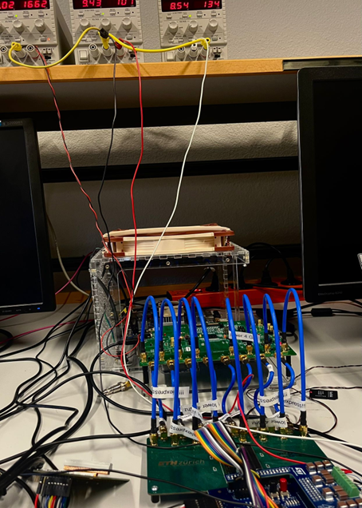

A dedicated Vivado ILA core was used to monitor internal signals in real time. Output data was captured and verified across multiple acquisition cycles, demonstrating consistent and repeatable synchronization behavior. The captured sinusoidal output is shown below:

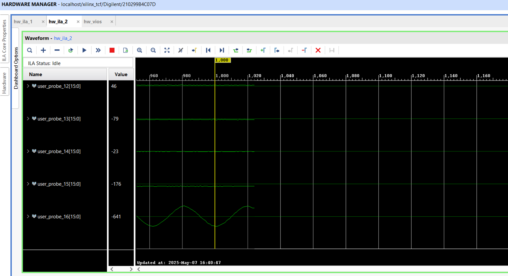

The hardware test validated that the receiver core can operate under realistic conditions at full line rate with successful capture on all 16 channels. Importantly, it also confirmed interoperability with commercially available JESD204B transmitters, establishing the design’s viability in real-world applications such as high-speed data acquisition and software-defined radio.

## Performance and Resource Utilization

The IP core was synthesized and implemented using Vivado targeting the Xilinx Zynq UltraScale+ ZU19EG device. The design was configured with two lanes **operating at 12.8 Gb/s**, which is the maximum possible rate supported in this standard. The post-implementation results showed that the IP utilized minimal logic resources compared to the total capacity of the device, as shown in the table below. This is significantly lower than the Xilinx IP as expected, since it does not have register re-configurability. This is a tradeoff for much lower resource utilization.

| **Resource**   | **This Design** | **Xilinx IP** |
|:---------------|:---------------:|:-------------:|
| CLB LUTs       |       437       |     2092      |
| CLB Registers  |       429       |     1988      |
| CARRY8 Blocks  |        2        |      46       |
| F7 Muxes       |        0        |      74       |
| F8 Muxes       |        0        |      22       |
| CLBs           |       107       |      470      |
| LUTs as Logic  |       277       |     1772      |
| LUTs as Memory |       160       |      320      |

*Resource Utilization Comparison: This Design vs. Xilinx IP*

Timing closure was achieved with no critical paths, and the design maintained a healthy timing margin in all configurations tested. The worst negative slack (WNS) was 0.313 ns, and no timing violations were reported in either hold or pulse width domains. These results confirm that the design is stable and timing-closed for the targeted UltraScale+ FPGA at the configured data rates.

**Post-Implementation Timing Summary**

| **Category** | **Metric** | **Value** |
|:-------------|:----------:|:---------:|
| Setup | Worst Negative Slack (WNS) | 0.313 ns |
| | Total Negative Slack (TNS) | 0.000 ns |
| Hold | Worst Hold Slack (WHS) | 0.004 ns |
| | Total Hold Slack (THS) | 0.000 ns |
| Pulse Width | Worst Pulse Width Slack (WPWS) | 0.469 ns |
| | Total PW Negative Slack (TPWNS) | 0.000 ns |

## Summary

The results obtained from both simulation and hardware testing establish the functional correctness and protocol compliance of the developed JESD204B RX IP core. The design was shown to interoperate with standard Physical layer interfaces, handle protocol state transitions reliably, and recover correctly framed, descrambled, and synchronized data. In addition, its integration into a Vivado-based design flow and its low resource footprint further underscore its suitability for usage in a variety of projects.
